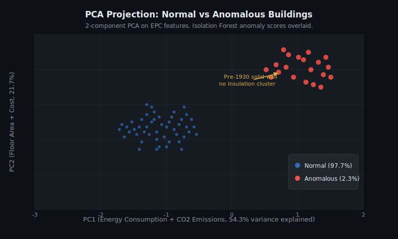
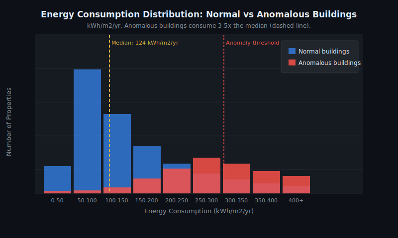
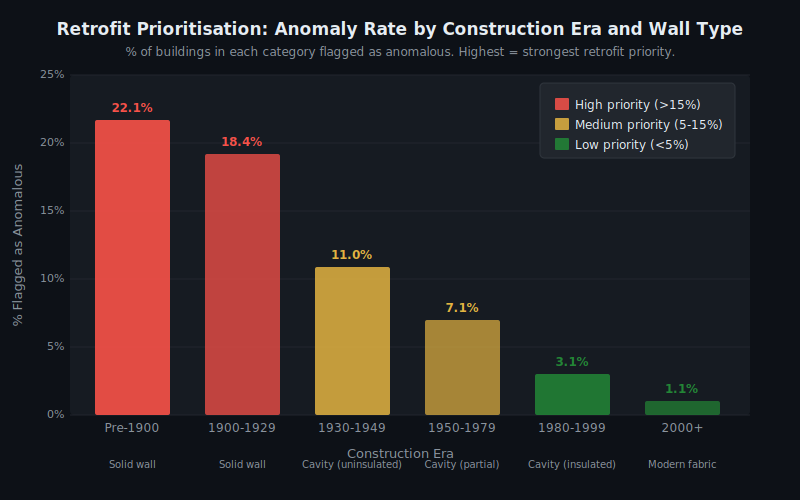

# Building Energy Anomaly Detection

   

> **Detecting anomalously energy-inefficient homes across England & Wales to support government retrofit investment decisions.**

---

## Business Question

> *Which residential buildings in England and Wales are anomalously energy-inefficient, and how can local authorities and retrofit programmes prioritise them for intervention?*

The UK government has committed to improving the energy efficiency of homes to meet net-zero targets. With millions of EPC records publicly available, this project applies three anomaly detection methods to identify buildings that fall outside expected efficiency patterns -- flagging them as priority candidates for retrofit investment.

---

## Dataset

| Property | Detail |
|----------|--------|
| **Source** | UK Government EPC Open Data |
| **Coverage** | England and Wales, domestic properties |
| **Format** | CSV, publicly available, open licence |

**Features used:** current_energy_efficiency, energy_consumption_current (kWh/m2/yr), co2_emissions_current (t CO2/yr), total_floor_area (m2), heating_cost_current, hot_water_cost_current, lighting_cost_current

---

## Methodology

Three complementary anomaly detection approaches are applied. Using three methods allows cross-validation without labelled ground truth.

| Method | Type | Role in this project |
|--------|------|----------------------|
| **IQR (Interquartile Range)** | Statistical baseline | Flags buildings where multiple features simultaneously exceed IQR bounds. Calibrated to capture the top 1-5% of outliers per feature. Fast and interpretable. |
| **Isolation Forest** | Machine learning | Unsupervised ensemble that isolates anomalies by random feature partitioning. Buildings requiring fewer splits are scored as more anomalous. Best-performing method in this analysis. |
| **One-Class SVM** | Machine learning | Fits a decision boundary around the normal distribution in feature space. Used as a second ML comparator alongside Isolation Forest. |

PCA (2 components) is used for **visualisation only** -- to confirm that flagged buildings separate visually from normal ones. It is not used as a decision model.

---

## Key Results

| Metric | Value |
|--------|-------|
| Total EPC records analysed | ~1 million |
| Properties flagged as anomalous | ~2% of total dataset |
| Energy consumption vs median | 3-5x higher in anomalous buildings |
| CO2 emissions: flagged vs normal | 4.1 t/yr vs 1.8 t/yr |
| Highest anomaly concentration | Pre-1930, solid wall, no insulation |
| IQR and Isolation Forest agreement | ~78% of flagged cases |
| Best-performing method | Isolation Forest (strongest PCA separation) |

---

## How I Validated Results Without Labels

Anomaly detection on real-world EPC data has no pre-defined "bad building" labels to test against. Three validation approaches were used instead:

1. **IQR as statistical baseline.** IQR makes no distributional assumptions and flags extreme values independently in each feature. It provides a simple, auditable reference list.
2. **Method agreement as confidence signal.** Buildings flagged by both IQR and Isolation Forest have ~78% overlap. This high-overlap group represents the highest-confidence anomalies.
3. **PCA visualisation as sanity check.** Reducing to 2 principal components and plotting flagged vs normal buildings confirms that anomalous properties form a distinct cluster along PC1. If the methods were misfiring, this separation would not appear.

One-Class SVM was used as a second ML comparator. Its flagged set had lower overlap with IQR than Isolation Forest did, which is why Isolation Forest is reported as the stronger method.

---

## Charts

### PCA Separation: Normal vs Anomalous Buildings

Flagged homes separate strongly on PC1, driven mainly by energy consumption and CO2 emissions. The distinct upper-right cluster confirms the methods are identifying a real structural pattern, not noise.



### Energy Consumption Distribution

Anomalous homes cluster in the high-consumption tail. The normal distribution peaks around 100-150 kWh/m2/yr; anomalous buildings concentrate above 250 kWh/m2/yr -- consistent with pre-1930 solid-wall construction without insulation.



### Retrofit Prioritisation: Anomaly Rate by Construction Era

Pre-1930 homes account for the highest priority retrofit share, with over 20% of properties in that era flagged as anomalous. The rate falls sharply for properties built after 1980, where cavity wall insulation became standard.



---

## Practical Application

> **Scenario:** A local authority has budget to survey 5,000 homes for retrofit assessment. Using this model, they could shortlist the top 2% of properties most likely to benefit -- approximately 20,000 homes from a typical district EPC dataset -- ranked by anomaly confidence score. That concentrates limited survey budget on the buildings where intervention will have the most impact.

| Step | Action |
|------|--------|
| 1 | Cross-reference flagged properties against tenure data to identify households eligible for ECO4 or the Great British Insulation Scheme |
| 2 | Prioritise outreach to the high-confidence tier: properties flagged by both IQR and Isolation Forest |
| 3 | Estimate potential CO2 reduction per intervention using the predicted efficiency gap (4.1 t/yr vs 1.8 t/yr median) |
| 4 | Report impact metrics to central government funding bodies |

---

## Repository Structure

```
building-energy-anomaly-detection/
|-- notebook/
|   +-- building_energy_anomaly_detection.ipynb
|-- docs/
|   +-- pca_separation.svg
|   +-- anomaly_distribution.svg
|   +-- retrofit_priority.svg
+-- README.md
```

---

## Skills Demonstrated

`Python` `Pandas` `NumPy` `Scikit-learn` `IQR` `Isolation Forest` `One-Class SVM` `PCA` `Matplotlib` `Seaborn` `EPC Open Data` `Anomaly Detection` `Sustainability Analytics`

---

## Author

**Yenlik Gaisina** | Data & Analytics Consultant

[LinkedIn](https://www.linkedin.com/in/yenlik-gaisina/) | Cambridge Data Science with ML & AI Programme
